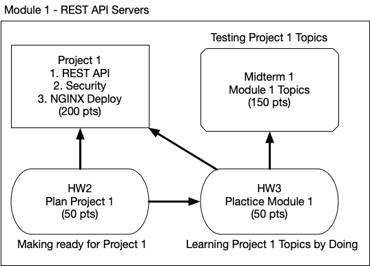

<!-- _class: lead -->
<!-- _class: frontpage -->
<!-- _paginate: skip -->

# Module 1 Structure (450 Points)

---

## Goal of Module 1

In this module, students learn the following:

1. REST API Implementation
2. Server Side Security
3. Deployment

---

## Module 1 Components

### Project (200 Points)

Students implement a REST API Server using PHP and MySQL database.

1. The Server is written in PHP.
2. The server uses a MySQL database.
3. The server provides REST API services.
4. The server supports secure access.
5. The server can be deployed to real-world servers.

---

### Two Homework Assignments (100 Points)

- At HW2, Students make ready for the Project (50 Points).

- At HW3, Students answer questions in the `questions` directory. (50 points)
  - Use VSCode/Marp to read questions and answer them.

---

### Midterm (150 Points)

Most midterm questions are modifications of HW3.

---

