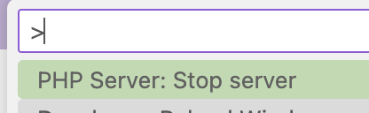

<!-- _class: lead -->
<!-- _class: frontpage -->
<!-- _paginate: skip -->

# PHP OOP — "Student" Example

---

- PHP supports **OOP (Object-Oriented Programming)**  
- OOP makes it easier to handle **complex data**  
  - **Class** = blueprint  
  - **Object** = thing built from the blueprint  
  - Start **simple**, add features later  
  
---

## 1) A Student Class

Three main components:

1. Fileds (variables in a class)
2. Constructor
3. Methods (functions in a class)

---

### Fields

- The Student class has fields (variables in an object).
- `public` means any other object can access it.

```php
<?php
declare(strict_types=1);

/**
 * A Student class:
 */
class Student {
  public int $id;
  public string $name;
  public string $email;
```

---

### Constructor

- A constructor (__construct) is called when this class is instantiated as an object.
- $this means this object, and we use the `->` operator to access any element in the object.

```php
  public function __construct(
    int $id, string $name, string $email) {
    $this->id = $id;
    $this->name = $name;
    $this->email = $email;
  }
```

---

### Methods

- A function in a class is called `method`.
- `$this` means this object, so `$this->name` means the name field in the object.

```php
  public function greet(): string {
    return "Hi, I'm {$this->name}!";
  }
```

---

## 2) Make an Object and Use It

```php
<?php
require 'Student.php'; // if you split files; else ignore

$s1 = new Student(1, 'Alice Johnson', 'alice@university.edu');

echo $s1->greet();              // "Hi, I'm Alice Johnson!"
echo PHP_EOL;
echo $s1->email;                // direct access (simple start)
```

- new Student(...) builds an object; the constructor is called automatically.
- Methods like greet() are the object’s behavior.
- We use the `->` operator to access the method of an object.

---

## 3) Turn an Object into an array (API-ready)

- We use the toArray() method (a function in a class) to return an array.

```php
<?php
  /** Convert to an array */
  public function toArray(): array {
    return [
      'id'    => $this->id,
      'name'  => $this->name,
      'email' => $this->email,
    ];
  }
```

---

- In this example, we make a Student object, and get an array from the `toArray()` method.
- We use json_encode() PHP function to make a JSON string.

```php
$s1 = new Student(1, 'Alice Johnson', 'alice@university.edu');

echo json_encode($s1->toArray(), JSON_PRETTY_PRINT);
/*
{
  "id": 1,
  "name": "Alice Johnson",
  "email": "alice@university.edu"
}
*/
```

---

## Run student_test.php

In VSCode, if you use `PHP Server` extension.

1. Open the `stduent_test.php`
2. Click the  PHP icon .
3. Web browser will be opened with `http://localhost:3000/student_test.php`.
4. Use `Cmd-Shift-P` (Mac) or `Ctrl-Shift-P` (PC) to open command.
5. Choose "PHP Server:Stop sever" to stop the server.



---

In VSCode Terminal, you can run the server using `php -S localhost:8000`.

1. You can choose any other port number.
2. Open a web browser, and access using `http://localhost:8000/student_test.php`.
3. Use `Ctrl-C` to stop the server.
