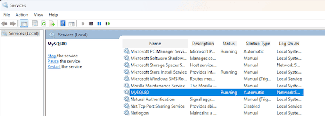

<!-- _class: lead -->
<!-- _class: frontpage -->
<!-- _paginate: skip -->

# MySQL Installation and Set Up

---

## Installing MySQL on Windows

---

### Option 1: XAMPP

- For the installation, use the "PHP_installation" document.

#### ✅ Start MySQL

- Open **XAMPP Control Panel**
- Click **Start** next to **MySQL**

#### ⛔ Stop MySQL

- Click **Stop** in XAMPP Control Panel

---

### Option 2: MySQL Installer (Official)

- Download from [mysql.com](https://dev.mysql.com/downloads/installer/)
- Choose **Server Only** or **Full Setup**
- Guided installation with GUI

---

#### Start/Stop MySQL

- Use **Services app** (`services.msc`)



---

- Or use **Command Prompt**:

  ```bash
  net start MySQL80
  net stop MySQL80
  ```

  *(Replace `MySQL80` with your actual service name)*

---

### Option 3: ZIP Archive (Manual Setup)

- Download MySQL **ZIP Archive** (not Installer)
- Extract to a folder (e.g., `C:\mysql`)
- Create `my.ini` file for configuration
- Initialize and install the service via the command line

#### Key Commands

```bash
mysqld --initialize --console
mysqld --install MySQL
net start MySQL
net stop MySQL
```

---

### Summary of MySQL Windows Installation

| Method          | Difficulty   | Best For                       |
|-----------------|--------------|--------------------------------|
| XAMPP           | ⭐ Easiest    | Beginners, quick setup         |
| MySQL Installer | ⭐⭐ Medium    | Structured install, GUI        |
| ZIP Archive     | ⭐⭐⭐ Advanced | Full control, real-world setup |

- MySQL was made for Linux and ported to Windows Later, so there are many options to choose from.

---

### Recommendation

- Start with **XAMPP** for simplicity
- Use **Installer** or **ZIP** method to learn MySQL configuration and service management
- Practicing manual setup builds professional skills
- Ready to use Linux with Docker and WSL2.

---

## Installing MySQL on macOS

1. Open Terminal.
2. Install Homebrew if not installed:
3. Install MySQL using Homebrew:

   ```bash
   brew install mysql
   ```

---

### Option 1: Running MySQL Using brew (Recommended)

- Start and stop MySQL service using brew (run mysql as a service):

   ```bash
   brew services start mysql
   brew services stop mysql
   ```

---

### Option 2: Running MySQL Using mysql.server

- Start and stop MySQL service using the command:

   ```bash
   mysql.server start
   mysql.server stop
   ```

- You can use mysqladmin

   ```bash
    mysqladmin -u root -p shutdown
    ```

---

## Installing MySQL on Linux (Ubuntu/Debian)

- Update packages

   ```bash
   sudo apt update && sudo apt upgrade
   ```

- Install MySQL server

   ```bash
   sudo apt install mysql-server
   ```

---

- Check status, start, and stop service

   ```bash
   sudo systemctl status mysql
   sudo systemctl start mysql
   sudo systemctl stop mysql
   ```

---

## Password Change

1. Verify installation by logging in:

   ```bash
   mysql -u root -p
   ```

2. Change password

   ```bash
   # choose any password you prefer
   mysqladmin -u root password 'NewPassword'
   ```

---

### Password security (Optional)

- For better security, you can change the password validation policy.
- Secure your root password right after installation.

   ```bash
   mysql_secure_installation
   ```

- When you need to remove the password validation policy.

   ```bash
   mysql -u root -p
   UNINSTALL COMPONENT <file://component_validate_password';>
   ```

---

## Tips and Best Practices

- Choose the version compatible with your OS and system.
- Use official MySQL sources or package managers.
- Consider any GUI tools for easier management.

---

### Warnings When You Stop MySQL

- Stopping MySQL will disconnect all apps and users.
- Save your work before stopping.
- If you use **Homebrew**, `brew services start/stop mysql` is recommended.
- For managed installations, always use official scripts or the Services menu.
