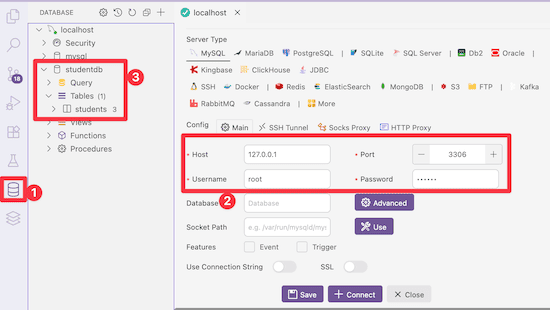

<!-- _class: frontpage -->
<!-- _paginate: skip -->
# Simple PHP Server with MySQL

---

## Creating MySQL DB & Table

- Use the **MySQL shell** (command line)
- Use GUI tools like:

  - **phpMyAdmin** (included with XAMPP)
  - **VS Code extensions**
  - **MySQL Workbench**, **DBeaver**, etc.

---

- Step 1: Log in to MySQL (Enter your root password when prompted)

   ```bash
   mysql -u root -p
   ```

---

- Step 2: Create and Use Database

In this example, a student DB stores a student id, name (string), age (int), and major (string).

   ```sql
   CREATE DATABASE studentdb;
   USE studentdb;
   ```

---

- Check if you have the students' database (we created in the previous section)

   ```bash
   mysql> show databases;
   +--------------------+
   | Database           |
   +--------------------+
   | information_schema |
   | mysql              |
   | performance_schema |
   | studentdb          |
   | sys                |
   +--------------------+
   ```

---

- Step 3: Create a Table

   ```sql
   CREATE TABLE students (
     id INT AUTO_INCREMENT PRIMARY KEY,
     name VARCHAR(100),
     age INT,
     major VARCHAR(100)
   );
   ```

- Step 4: View Tables

   ```sql
   SHOW TABLES;
   ```

---

## Access MySQL Database Files 

The MySQL DB is created and stored in the directory:

1. On macOS (Homebrew install typical for devs):

- Default data directory: `/usr/local/var/mysql`

2. On Linux:

- Default data directory: `/var/lib/mysql`

3. On Windows:

- Usually under the MySQL install path: `C:\ProgramData\MySQL\MySQL Server X.Y\Data\`

---

## Access MySQL VSCode Extension

You can use VSCode MySQL Extension to access MySQL DB.




---

## Access MySQL Database using PHP

```php
<?php
$servername = "localhost";
$username = "root";
$password = "password";
$dbname = "studentdb";

// Create connection
$conn = new mysqli($servername, $username, $password, $dbname);

// Check connection
if ($conn->connect_error) {
    die("Connection failed: " . $conn->connect_error);
}
echo "Connected successfully";

// Close connection
$conn->close();
?>
```

---

- You need to set your password correctly.
- You should see the "Connected successfully" message in your browser.


---

### Adding Students

- We can use SQL command "INSERT INTO" to add students to the database.

```php
// Insert record
$name = "Student2";
$age = 20;
$major = "Computer Science";

$sql = "INSERT INTO students (name, age, major) VALUES (?, ?, ?)";
$stmt = $conn->prepare($sql);
$stmt->bind_param("sis", $name, $age, $major);

if ($stmt->execute()) {
    echo "New student added successfully";
} else {
    echo "Error: " . $stmt->error;
}

$stmt->close();
```

---

## PDO_MySQL Installation

You can use PHP Dataobject (pdo_mysql) to connect between PHP and MySQL.

- **PDO** = *PHP Data Objects*  
  - A standard way for PHP to connect to many databases.  
- **pdo_mysql** = the PDO driver for **MySQL** (and MariaDB).  
  - It lets PHP talk to a MySQL server using the PDO interface.  

Without it, PHP can’t use `new PDO("mysql:...")` connections.

---

### Benefits of using **PDO (pdo_mysql)**

- **Unified API**: Same functions work for MySQL, SQLite, PostgreSQL, etc.  
  (Change only the DSN string, not the code.)  
- **Prepared Statements**: Protect against SQL injection.  
- **Better Error Handling**: Can throw exceptions → easier debugging.  
- **Flexible Fetching**: Arrays, objects, key-value pairs.  
- **Portability**: Write once, connect to many DBs with minimal change.  
- **Cleaner Code**: Consistent and modern interface compared to old `mysqli_*`.  

---

### Example (pdo_mysql)

```php
<?php
$servername = "localhost";
$username = "root";
$password = "123456";
$dbname = "studentdb";

try {
  // Create PDO connection
  $dsn = "mysql:host=$servername;dbname=$dbname;charset=utf8mb4";
  $options = [
    PDO::ATTR_ERRMODE => PDO::ERRMODE_EXCEPTION, // throw exceptions
    PDO::ATTR_DEFAULT_FETCH_MODE => PDO::FETCH_ASSOC,
    PDO::ATTR_EMULATE_PREPARES => false, // use real prepared statements
  ];
  $pdo = new PDO($dsn, $username, $password, $options);

  echo "Connected successfully\n";

  // Insert record
  $name = "Student2";
  $age = 20;
  $major = "Computer Science";

  $sql = "INSERT INTO students (name, age, major) VALUES (:name, :age, :major)";
  $stmt = $pdo->prepare($sql);

  $stmt->execute([
    ':name' => $name,
    ':age' => $age,
    ':major' => $major,
  ]);

  echo "New student added successfully";

} catch (PDOException $e) {
  echo "Connection failed: " . $e->getMessage();
}
?>
```

---

### Check pdo_mysql installation

pdo_mysql should be installed.

```bash
> php -m | grep pdo_mysql
pdo_mysql

> php -i | grep "PDO drivers"
PDO drivers => dblib, mysql, odbc, pgsql, sqlite
```
