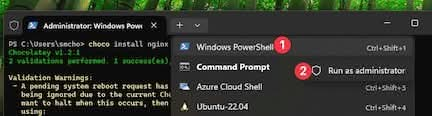

<!-- _class: frontpage -->
<!-- _paginate: skip -->
<!-- version: 1.0.0 -->
# (Optional) Installing NGINX using Choco

---

## Understanding SC and NSSM

### Windows Service Controller (SC)

- It’s a built-in Windows command-line tool.
- You use it to create, start, stop, delete, or query Windows services.

```cmd
sc create MyService binPath= "C:\path\to\myprogram.exe"
sc start MyService
sc stop MyService
sc delete MyService
```

---

### Non-Sucking Service Manager (NSSM)

- It’s a third-party tool that makes it easier to run any program (like nginx, php-cgi, python, node, etc.) as a Windows service.
- Useful because some programs don’t behave like proper services, and sc alone struggles with them.

```cmd
nssm install MyService C:\path\to\myprogram.exe
```

---

### Install Choco (if not installed)

1. Open PowerShell as Administrator

Choose Powershell in Terminal tab -> Right click on the "Windows Powershell" -> Open a Terminal.



---

2. Run this command:

```powershell
Set-ExecutionPolicy Bypass -Scope Process -Force; `
[System.Net.ServicePointManager]::SecurityProtocol = `
[System.Net.ServicePointManager]::SecurityProtocol -bor 3072; `
iex ((New-Object System.Net.WebClient).DownloadString('https://community.chocolatey.org/install.ps1'))
```

3. Check version

```powershell
choco --version
```

---

## Checking Choco

Check what packages are installed using choco.

```bash
C:\Users\smcho>choco list -l
Chocolatey v1.2.1
chocolatey 1.2.1
chocolatey-compatibility.extension 1.0.0
chocolatey-core.extension 1.4.0
```

---

## Install NGINX

Install in the Powershell admiinstrator mode.

```powershell
choco install nginx
```

---

## Step 3: Start NGINX

```powershell
# Navigate to NGINX directory (usually C:\tools\nginx)
cd C:\tools\nginx
.\nginx.exe
```

1. Choco installs nginx in `c:\tools\nginx-VERSION`.

---

2. Choco runs post install script to run `nginx` automatically.

```powershell
PS C:\Users\smcho> tasklist | findstr nginx
nginx.exe                     7708 Services                   0     10,012 K
nginx.exe                    12292 Services                   0     10,204 K
```

Choco also installs nssm as a dependency.

```powershell
PS C:\Users\smcho> choco list -l
nginx 1.29.0
nssm 2.24.101.20180116
```

---

3. Open your browser and access "localhost" to see nginx is running.

---

## nssm and nginx

When installing nginx using Chocolatey (choco), the Non-Sucking Service Manager (NSSM) is installed and used to manage nginx as a Windows service instead of the native Windows Service Controller (sc).

- Use `nssm start/stop/restart` not `sc`.

```bash
nssm start nginx
nssm stop ngix
nssm restart nginx
```

---

```powershell
PS C:\Users\smcho> nssm stop nginx
nginx: STOP: The operation completed successfully.

PS C:\Users\smcho> tasklist | findstr nginx

PS C:\Users\smcho> nssm start nginx
nginx: START: The operation completed successfully.

PS C:\Users\smcho> tasklist | findstr nginx
nginx.exe                    20592 Services                   0      9,840 K
nginx.exe                     7068 Services                   0     10,172 K
```

---

### To remove nginx as a service

```bash
nssm stop nginx
nssm remove nginx confirm
```

### To start nginx as a service again

```bash
nssm install nginx "C:\tools\nginx-1.29.0\nginx.exe"
nssm start nginx
```

---

### Uninstall nginx/nssm

- You can uninstall nginx.

```bash
choco uninstall nginx
```

- If choco installs nssm (together with nginx), and if you want to delete nssm.

```bash
choco uninstall nssm
```

---

## NSSM, SC, and NGINX

- You use nssm once to install, and after that, you can use sc or net commands for daily start/stop.

- sc only works if nginx is properly registered as a service.

```powershell
PS C:\Users\smcho> sc.exe query type= service state= all | findstr /I "nginx"
SERVICE_NAME: nginx
DISPLAY_NAME: nginx
```

---

- Be sure to use sc.exe, not sc, in Powershell.

```powerhsell
PS C:\Users\smcho> sc.exe stop nginx

SERVICE_NAME: nginx
        TYPE               : 10  WIN32_OWN_PROCESS
        STATE              : 3  STOP_PENDING
                                (NOT_STOPPABLE, NOT_PAUSABLE, IGNORES_SHUTDOWN)
        WIN32_EXIT_CODE    : 0  (0x0)
        SERVICE_EXIT_CODE  : 0  (0x0)
        CHECKPOINT         : 0x1
        WAIT_HINT          : 0xdac
PS C:\Users\smcho> sc.exe start nginx

SERVICE_NAME: nginx
        TYPE               : 10  WIN32_OWN_PROCESS
        STATE              : 2  START_PENDING
                                (NOT_STOPPABLE, NOT_PAUSABLE, IGNORES_SHUTDOWN)
        WIN32_EXIT_CODE    : 0  (0x0)
        SERVICE_EXIT_CODE  : 0  (0x0)
        CHECKPOINT         : 0x0
        WAIT_HINT          : 0x7d0
        PID                : 20836
```
