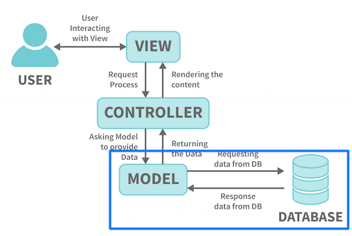

<!-- _class: frontpage -->
<!-- _paginate: skip -->

# Migration Basics

Database Schema as Code Basics

---

## Tables vs Migrations

### Database Setup:

We create a table "students".

```sql
-- Manual SQL file
CREATE TABLE students (
    id INT PRIMARY KEY AUTO_INCREMENT,
    name VARCHAR(255) NOT NULL,
    email VARCHAR(255) UNIQUE,
    major VARCHAR(100),
    year INT,
    created_at TIMESTAMP DEFAULT CURRENT_TIMESTAMP
);
```

---

### Laravel Migrations:

The same table is represented using migrations.

```php
// database/migrations/2024_01_01_000000_create_students_table.php
public function up(): void
{
    Schema::create('students', function (Blueprint $table) {
        $table->id();
        $table->string('name');
        $table->string('email')->unique();
        $table->string('major');
        $table->integer('year');
        $table->timestamps();
    });
}
```

---

We use artisan command to create a table (students in this example) in a database.

```bash
# Create the migration file
php artisan make:migration create_students_table

# Run migrations (executes up() method)
php artisan migrate

# Rollback migrations (executes down() method)
php artisan migrate:rollback
```

---

### Why Migrations Matter

**Problems with Manual SQL:**

- ❌ Hard to track database changes
- ❌ Team members have different database structures
- ❌ No version control for the database
- ❌ Difficult to deploy changes

---

**Benefits of Migrations:**

- ✅ **Version controlled** - Track all changes
- ✅ **Team synchronization** - Everyone has same structure
- ✅ **Rollback capability** - Undo changes safely
- ✅ **Environment consistency** - Dev/staging/production match

---

## Creating Model

### Generate Model with Migration:

```bash
php artisan make:model Student -m
```



---

## Generated Model - Student.php

This is the generated code.

```php
namespace App\Models;
use Illuminate\Database\Eloquent\Model;
class Student extends Model
{
    //
}
```

- Basic Eloquent ORM model
- Inherits all methods from Model (e.g., all(), find(), create())

However, we need to add code to make the working Student model.

---

### Add Mass Assignment & Protection:

protected $fillable - Lists which database columns can be filled when creating/updating records

```php
<?php
namespace App\Models;
use Illuminate\Database\Eloquent\Model;
class Student extends Model
{
    // Fields that can be mass-assigned
    protected $fillable = [
        'name', 'email', 'major', 'year'
    ];
}
```

**This enables `Student::create()` functionality.**

---

### Filling multiple fields of a model at once

Here, all 4 fields are being assigned in one go.

```php
Student::create([
    'name' => 'Alice',
    'email' => 'alice@example.com',
    'major' => 'CS',
    'year' => 2
]);
```

---

**Hacking Prevention!**

Without protection, a malicious user could try to send extra fields you don’t want them to modify:

```php
POST /students
{
  "name": "Evil",
  "email": "evil@example.com",
  "year": 5,
  "is_admin": 1   // ❌ attacker injects this
}
```

If Laravel just mass-assigns everything, the user might give themselves admin privileges.

---

**Laravel Solution**

Laravel forces you to whitelist or blacklist fields.

- $fillable = list of fields you allow for mass assignment.
- $guarded = opposite — list of fields you disallow.

```php
protected $fillable = ['name', 'email', 'major', 'year'];
protected $guarded = ['id', 'is_admin'];
```

---

## Running Migrations

### Create Table with Migration

Instead of writing SQL by hand, use **Laravel Migrations**:

```bash
php artisan migrate
```

---

### What Happens?

Laravel generates the SQL for you:

```sql
CREATE TABLE students (
    id BIGINT UNSIGNED AUTO_INCREMENT PRIMARY KEY,
    name VARCHAR(255) NOT NULL,
    email VARCHAR(255) NOT NULL UNIQUE,
    major VARCHAR(255) NOT NULL,
    year INT NOT NULL,
    created_at TIMESTAMP NULL,
    updated_at TIMESTAMP NULL
);
```

**No manual SQL required!**

---

### Rolling back

This command rolls back the last batch of migrations.

```bash
php artisan migrate:rollback
```
