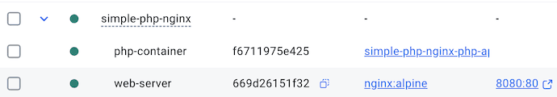

<!-- _class: frontpage -->
<!-- _paginate: skip -->

# Docker with PHP and NGINX

Simple Web Development with Containers

---

## Why Docker with NGINX?

### Traditional Problems:

```txt
❌ "It works on my machine" syndrome
❌ Manual PHP and NGINX installation
❌ Configuration file management
❌ Different versions across team members
```

---

### Docker Solution:

```txt
✅ Same environment everywhere
✅ No manual installation for PHP & NGINX needed
✅ Configuration in code
✅ Easy to share and replicate
```

---

## Architecture Overview

### What We're Building:

```txt
[Browser] → [NGINX Container] → [PHP Container] → [Your PHP App]
              Port 8080           Port 9000        
```

### Key Concepts:

- **NGINX Container**: Handles web requests and static files
- **PHP Container**: Processes PHP code
- **Container Communication**: They talk to each other
- **Volume Sharing**: Both containers access same files

---

## Step 1: Create Project Structure

### Create Project Directory:

```bash
mkdir simple-php-nginx
cd simple-php-nginx
```

---

### Project Structure:

```txt
simple-php-nginx/
├── www/
│   ├── index.php
│   └── info.php
├── nginx/
│   └── default.conf
├── php/
│   └── Dockerfile
└── docker-compose.yml
```

---

## Step 2: Create PHP Files

### Create `www/index.php`:

```php
<html lang="en">
<head>
    <meta charset="UTF-8">
    <meta name="viewport" content="width=device-width, initial-scale=1.0">
    <title>PHP + NGINX with Docker</title>
    ...
</head>
<body>
    <div class="container">
        <h1>🐳 PHP + NGINX Docker Setup</h1>
    </div>
</body>        
```

---

### Create `www/info.php`:

```php
<?php
// Display PHP configuration
phpinfo();
?>
```

### Create `www/test.php`:

```php
<?php
header('Content-Type: application/json');

echo json_encode([
    'message' => 'Hello from PHP Container!',
    'php_version' => phpversion(),
    'timestamp' => date('c'),
    'server' => $_SERVER['SERVER_SOFTWARE'] ?? 'Unknown',
    'container' => gethostname()
], JSON_PRETTY_PRINT);
?>
```

---

## Step 3: Create PHP Container

### Create `php/Dockerfile`:

- This time, we need to make a Dockerfile for PHP-FPM (FastCGI Process Manager)
  - We need to install PHP extensions and copy application files.
- We expose the PHP-FPM port to connect with NGINX.
  - The PHP-FPM uses port 9000 to communicate with NGINX.

---

```dockerfile
# Use official PHP with FPM (FastCGI Process Manager)
FROM php:8.2-fpm

# Set working directory
WORKDIR /var/www/html

# Install basic PHP extensions
RUN docker-php-ext-install pdo pdo_mysql

# Copy application files
COPY ../www /var/www/html

# Set proper permissions
RUN chown -R www-data:www-data /var/www/html

# Expose PHP-FPM port
EXPOSE 9000

# Start PHP-FPM
CMD ["php-fpm"]
```

---

## Step 4: Create NGINX Configuration

### Create `nginx/default.conf`:

- In the container, the NGINX server listens to port 80.
- **fastcgi_pass php-app:9000**: Connects to PHP container
- **Container name**: `php-app` is the service name
- **Port 9000**: Standard PHP-FPM port

---

```nginx
server {
    listen 80;
    server_name localhost;
    root /var/www/html;
    index index.php index.html;

    # Handle PHP files
    location ~ \.php$ {
        fastcgi_pass php-app:9000;  # Container name
        ...
    }
    # Handle static files
    location / {
        try_files $uri $uri/ =404;
    }

    # Security: deny access to hidden files
    location ~ /\. {
        deny all;
    }
}
```

---

## Docker Compose to handle Multiple Containers.

Then, we need to use `Docker Compose`.

---

### 1. One Container ≠ One System

- **Dockerfile** → defines a single container (e.g., PHP only)  
- Real apps need **multiple containers** (PHP + NGINX + DB)  
- Running each manually = messy and error-prone  

### 2. Compose = Orchestration

- `docker-compose.yml` lets you define:  
  - **Services** (nginx, php, db…)  
  - **Networks** (so containers talk to each other)  
  - **Volumes** (share code/data)  
- Run everything with **one command**:

```bash
docker compose up
```

---

## Step 5: Create Docker Compose

### Create `docker-compose.yml`:

- This is the nginx part of the configuration, which depends on the php-app section.
- It uses the 8080 port to map it to the NGINX 80 port.

```yaml
services:
  # NGINX Web Server
  nginx:
    image: nginx:alpine
    container_name: web-server
    ports:
      - "8080:80"
    volumes:
      - ./www:/var/www/html
      - ./nginx/default.conf:/etc/nginx/conf.d/default.conf
    depends_on:
      - php-app
```

---

- The php-app needs the Dockerfile in the php directory as it needs to build a new Docker image from an existing one.

```yaml
  # PHP Application
  php-app:
    build:
      context: .
      dockerfile: php/Dockerfile
    container_name: php-container
    volumes:
      - ./www:/var/www/html
```

- The `volumes` section **maps a local directory (host)**  
  → to a **directory inside the container**  

---

### What This Does:

- **nginx**: Uses official NGINX image
- **php-app**: Builds our custom PHP container
- **volumes**: Shares files between the host and containers
- **depends_on**: NGINX waits for PHP to start

---

## Step 6: Build and Run

### Build the Application:

```bash
# Build the PHP container
docker-compose build

# Start all services
docker-compose up -d

# Check if containers are running
docker-compose ps
```

---

### Expected Output:

```txt
NAME              IMAGE                    STATUS
web-server        nginx:alpine             Up
php-container     simple-php-nginx_php-app Up
```

If you use Docker Desktop, you can find that two Docker containers are up and running.



---

### Stop the Application

```bash
docker-compose down
```

---

## Step 7: Test Your Application

### Access Your Website:

1. **Main Page**: <http://localhost:8080>
2. **PHP Info**: <http://localhost:8080/info.php>
3. **Test API**: <http://localhost:8080/test.php>

### Verify Everything Works:

```bash
# Test with curl
curl http://localhost:8080

# Test JSON endpoint
curl http://localhost:8080/test.php
```

You should see your PHP application running!

---

## Understanding Container Communication

### How NGINX Finds PHP:

```nginx
# In nginx/default.conf
fastcgi_pass php-app:9000;
```

### Key Concepts:

- **Container Names**: Services use container names to communicate
- **Internal Network**: Docker creates a network for containers
- **Port Mapping**: Only the NGINX port (80) is exposed to the host (8080)
- **File Sharing**: Both containers access `/var/www/html`

---

## Common Commands

### Container Management:

```bash
# Start containers
docker-compose up -d

# Stop containers
docker-compose down

# View logs
docker-compose logs nginx
docker-compose logs php-app

# Restart specific service
docker-compose restart nginx
```

---

### Development Commands:

```bash
# Execute commands in the PHP container
docker-compose exec php-app php --version

# Execute commands in NGINX container
docker-compose exec nginx nginx -t

# Access container shell
docker-compose exec php-app bash
```

---

The rest of this section is for debugging purposes only; Use it when you have any issues.

---

## Troubleshooting (Optional)

### Issue 1: 502 Bad Gateway

**Cause**: NGINX can't reach the PHP container

**Solution**:

```bash
# Check if the PHP container is running
docker-compose ps php-app

# Check PHP logs
docker-compose logs php-app

# Restart PHP container
docker-compose restart php-app
```

---

### Issue 2: File Not Found

**Cause**: Incorrect file paths or permissions

**Solution**:

```bash
# Check file permissions
docker-compose exec php-app ls -la /var/www/html

# Fix permissions if needed
docker-compose exec php-app chown -R www-data:www-data /var/www/html
```

---

### Issue 3: Port Already in Use

**Cause**: Another service using port 8080

**Solution**:

```bash
# Change port in docker-compose.yml
ports:
  - "8081:80"  # Use a different port

# Or find what's using the port
lsof -i :8080  # macOS/Linux
netstat -ano | findstr :8080  # Windows
```

---

### Issue 4: Container Won't Start

**Solution**:

```bash
# Check detailed logs
docker-compose logs

# Rebuild containers
docker-compose build --no-cache
docker-compose up -d
```

---

## Making Changes

### Editing PHP Files:

1. Edit files in the `www/` directory
2. Refresh browser - changes appear immediately!
3. No need to rebuild containers

### Editing NGINX Config:

1. Edit `nginx/default.conf`
2. Restart NGINX: `docker-compose restart nginx`

### Editing Dockerfile:

1. Edit `php/Dockerfile`
2. Rebuild: `docker-compose build`
3. Restart: `docker-compose up -d`
