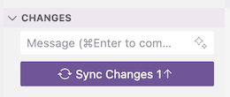

<!-- _class: frontpage -->
<!-- _paginate: skip -->

# GitHub.io Manual Deployment

Understanding Static Site Hosting by Deploying Hugo's Public Folder

---

## Learning Objectives

By the end of this session, you will:

✅ **Understand** what GitHub Pages hosts (static files)  
✅ **Deploy** Hugo's public/ folder manually to GitHub Pages  
✅ **Learn** the fundamentals of static site hosting  
✅ **Create** your first live portfolio URL  
✅ **Troubleshoot** common deployment issues  

**Goal**: Get your Hugo portfolio live by understanding exactly what gets deployed!

---

## What is GitHub Pages?

### **Simple Definition:**
>
> GitHub Pages = A **free web hosting service** that serves static files from your GitHub repository

### **Key Concepts:**

- 🌐 **Static hosting**: Serves HTML, CSS, JS files directly
- 🆓 **Free service**: No hosting costs for public repositories  
- ⚡ **Fast delivery**: Global CDN (Content Delivery Network)
- 🔒 **HTTPS included**: Automatic SSL certificates
- 📱 **Mobile optimized**: Works on all devices

---

## Understanding Static vs Dynamic Sites

### **Dynamic Sites (Traditional):**

```txt
User Request → Web Server → Database → PHP/Python → HTML Response
```

- **Examples**: WordPress, Laravel applications
- **Requires**: Server, database, runtime environment
- **Cost**: $10-50/month hosting

### **Static Sites (GitHub Pages):**

```txt
User Request → Pre-built HTML Files → Instant Response
```

- **Examples**: Hugo sites, documentation, portfolios
- **Requires**: Only HTML, CSS, JS files
- **Cost**: Free!

---

## What Hugo Generates: The Public Folder

### **Hugo Build Process:**

```bash
# Your Hugo source code
hugo

# Generates a static website in the public/ folder
```

### **What's in public/ folder:**

```txt
public/
├── index.html           # Homepage
├── about/
│   └── index.html       # About page
├── projects/
│   ├── index.html       # Projects listing
│   └── student-api/
│       └── index.html   # Individual project
├── css/                 # Stylesheets
├── js/                  # JavaScript
├── images/              # Your images
└── sitemap.xml          # SEO sitemap
```

**This is exactly what GitHub Pages will serve!**

---

## GitHub Pages Repository Types

### **User/Organization Pages (What We'll Use):**

```txt
Repository name: yourusername.github.io
URL: https://yourusername.github.io
Content: Main website (portfolio, company site)
```

### **Project Pages:**

```txt
Repository name: any-project-name
URL: https://yourusername.github.io/project-name  
Content: Documentation for specific projects
```

**Today's Focus**: User pages for your main portfolio

---

## Prerequisites Check

### **Required Before We Start:**

```bash
# 1. Hugo site built successfully
cd my-portfolio
hugo
ls public/  # Should show HTML files

# 2. GitHub account ready
# Visit github.com and sign in

# 3. Git configured
git config --global user.name "Your Name"
git config --global user.email "your.email@example.com"
```

---

## Step 1: Build Your Hugo Site

### **Clean Build Process:**

```bash
# Navigate to your Hugo site
cd my-portfolio

# Remove old build (if exists)
rm -rf public/

# Build fresh static site
hugo

# Verify build success
ls public/
```

---

### **Expected Output:**

```txt
public/
├── 404.html
├── index.html
├── index.xml
├── about/
├── projects/
├── posts/
├── css/
├── js/
└── images/
```

---

### **Common Build Issues:**

- **Draft content**: Set `draft = false` in front matter
- **Base URL**: Check `baseURL` in `hugo.toml`
- **Missing images**: Verify paths in static/ folder

### **Add markdown files**

- Use the `hugo new` command to add markdown files.
- Use the `hugo` command to generate files in the `public` directory to share.

---

### **Test Your Build Locally:**

```bash
# Serve the built site (not Hugo server)
cd public
python -m http.server 8000

# Visit: http://localhost:8000
# This is exactly what GitHub Pages will serve!
```

### **What to Check:**

✅ **Homepage loads** correctly  
✅ **All pages accessible** via navigation  
✅ **Images display** properly  
✅ **Styling works** completely  
✅ **Links function** between pages  

---

## Step 2: Create GitHub Repository

### **Repository Creation:**

1. **Go to GitHub**: Sign in to github.com
2. **Click "New Repository"**
3. **Repository Name**: `yourusername.github.io`
   - ⚠️ **Must match your username exactly**
   - Example: If username is `johndoe`, repo must be `johndoe.github.io`
4. **Visibility**: Public (required for free GitHub Pages)
5. **Initialize**: ✅ Add a README file
6. **Click "Create Repository"**

---

### **Why This Specific Name?**

```txt
Repository: johndoe.github.io
GitHub automatically recognizes this pattern
Creates a user page at: https://johndoe.github.io
Serves content from the main branch root directory
```

### **Important Notes:**

- **Case sensitive**: Must match your username exactly
- **Public required**: Private repos need GitHub Pro for Pages
- **One per account**: You get one user page per GitHub account

---

## Step 3: Clone Your Repository

### **Clone to Your Computer:**

```bash
# Clone the empty repository
git clone https://github.com/yourusername/yourusername.github.io.git

# Navigate into the repository
cd yourusername.github.io

# Check what's there
ls -la
# Should see: README.md and .git/ folder
```

### **Repository Structure (Initial):**

```txt
yourusername.github.io/
├── .git/           # Git version control
└── README.md       # Repository description
```

---

## Step 4: Copy Hugo's Public Folder

### **Manual Copy Method:**

```bash
# From your Hugo site directory
cd ../my-portfolio

# Copy everything from public/ to your GitHub repo
cp -r public/* ../yourusername.github.io/

# Navigate to GitHub repo
cd ../yourusername.github.io

# Verify copy worked
ls -la
```

### **What You Should See:**

```txt
yourusername.github.io/
├── .git/
├── README.md
├── index.html          # ← Hugo homepage
├── about/
├── projects/
├── posts/
├── css/
├── js/
└── images/
```

---

### **Alternative: Organized Copy**

```bash
# More careful approach
cd yourusername.github.io

# Remove default README (optional)
rm README.md

# Copy public folder contents
cp -r ../my-portfolio/public/* .

# Create custom README for your portfolio
echo "# My Professional Portfolio" > README.md
echo "Live site: https://yourusername.github.io" >> README.md
```

---

## Step 5: Deploy to GitHub

### **Add, Commit, and Push:**

```bash
# Check what files are ready to commit
git status

# Add all files
git add .

# Create descriptive commit message
git commit -m "Deploy Hugo portfolio site

- Add a complete static website
- Include homepage, projects, and about pages
- All images and styling included
- Ready for GitHub Pages hosting"

# Push to GitHub
git push origin main
```

---

### **Understanding What Happens:**

```txt
Local Computer → GitHub Repository → GitHub Pages
     ↓                    ↓                ↓
  Static files    Files stored in repo   Live website
  (public/)       (version controlled)   (served to users)
```

### **Timeline:**

- **Git push**: Immediate (uploads files)
- **Pages deployment**: 1-5 minutes (processing)
- **Global propagation**: 5-10 minutes (worldwide)

---

## Step 6: Enable GitHub Pages

### **Configure GitHub Pages:**

1. **Go to your repository** on GitHub
2. **Click "Settings"** tab (top menu)
3. **Scroll to "Pages"** in left sidebar
4. **Source section**:
   - Select **"Deploy from a branch"**
   - **Branch**: main
   - **Folder**: / (root)
5. **Click "Save"**

---

### **GitHub Pages Configuration Options:**

```txt
Source Options:
├── Deploy from a branch (what we're using)
│   ├── Branch: main, gh-pages, or any branch
│   └── Folder: / (root) or /docs
└── GitHub Actions (advanced - next lesson)
```

### **Our Setup:**

- **Source**: Deploy from a branch
- **Branch**: main  
- **Folder**: / (root)
- **Content**: Static HTML files from Hugo's public/

---

## Step 7: Verify Your Live Site

### **Access Your Website:**

```txt
URL: https://yourusername.github.io
Example: https://johndoe.github.io
```

### **First Deployment:**

- **Processing time**: 1-5 minutes
- **Status check**: Repository Settings > Pages
- **Green checkmark**: Deployment successful
- **Error message**: Check build logs

---

### **Testing Checklist:**

✅ **Homepage loads** without errors  
✅ **Navigation menu** links work correctly  
✅ **About page** displays your information  
✅ **Projects section** shows your work  
✅ **Images load** properly  
✅ **Mobile responsive** on phone/tablet  
✅ **HTTPS works** (should be automatic)  
✅ **Professional appearance** matches local version  

---

## Step 8: Understanding File Structure

### **What GitHub Pages Serves:**

```txt
GitHub Repository Root:
├── index.html          → https://yourusername.github.io/
├── about/
│   └── index.html      → https://yourusername.github.io/about/
├── projects/
│   ├── index.html      → https://yourusername.github.io/projects/
│   └── student-api/
│       └── index.html  → https://yourusername.github.io/projects/student-api/
└── css/
    └── style.css       → https://yourusername.github.io/css/style.css
```

---

### **URL Mapping:**

- **Repository file** → **Website URL**
- **Root index.html** → **Homepage**
- **Folder/index.html** → **Clean URLs** (no .html)

---

## Step 9: Making Updates

### **When You Change Your Hugo Site:**

```bash
# 1. Edit content in the Hugo site
cd my-portfolio
# Make changes to content/, themes/, etc.

# 2. Build updated site
hugo

# 3. Copy new build to GitHub repo
cp -r public/* ../yourusername.github.io/

# 4. Commit and push changes (Manual)
cd ../yourusername.github.io
git add .
git commit -m "Update portfolio: added new project"
git push origin main
```

---

**Use VSCode for commit & push (recommended)**

1. Open the cloned GitHub.io directory using VSCode.
2. Commit & Push (Sync) so VSCode takes care of everything



---

### **Each update requires this manual process!**

*(Next lesson: We'll automate this with GitHub Actions)*

---

## Understanding GitHub Pages Limitations

### **What GitHub Pages Can Host:**

✅ **Static HTML/CSS/JS** files  
✅ **Images, fonts, documents**  
✅ **Client-side applications** (React, Vue after build)  
✅ **Static site generators** (Hugo, Jekyll, Gatsby)  

### **What GitHub Pages Cannot Host:**

❌ **Server-side code** (PHP, Python, Node.js)  
❌ **Databases** (MySQL, PostgreSQL)  
❌ **Server processing** (form handling, APIs)  
❌ **File uploads** or user authentication  

**Perfect for portfolios, documentation, blogs!**

---

## Performance and Best Practices

### **Optimizing Your Site:**

```bash
# Minify HTML/CSS/JS (Hugo can do this)
hugo --minify

# Optimize images before adding to Hugo
# Use WebP format, compress large images
# Recommended: <500KB per image

# Use CDN for external resources
# Google Fonts, jQuery, etc.
```

---

### **Professional Checklist:**

✅ **Fast loading** (< 3 seconds)  
✅ **Mobile responsive** design  
✅ **Professional content** and imagery  
✅ **Working contact** information  
✅ **Error-free** links and navigation  
✅ **SEO optimized** (titles, descriptions)  

---

## Sharing Your Portfolio

### **Professional Uses:**

```txt
Resume/CV: Include your GitHub Pages URL
Email Signature: https://yourusername.github.io
Business Cards: Print your professional domain
LinkedIn Profile: Add website link
Job Applications: Live portfolio demonstration
```

### **Social Sharing:**

- **Easy to remember**: Short, clean URL
- **Professional appearance**: Custom domain look
- **Always accessible**: 24/7 global availability
- **No hosting costs**: Free professional presence
