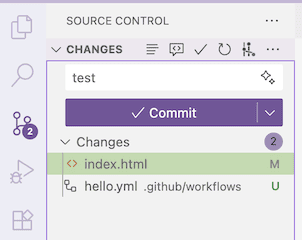

<!-- _class: frontpage -->
<!-- _paginate: skip -->

# GitHub Actions Basics

From Manual Work to Automatic Magic

---

## Where We Are Now

### **What You Know (Manual Process):**

```txt
1. 🏗️ Build Hugo site (hugo command)
2. 📁 Copy files from public/ folder  
3. ⬆️ Upload files to GitHub repository
4. 🌐 Website goes live
5. 🔄 Repeat for every change
```

---

### **The Problem:**

- Takes 5-10 minutes every time you make a change
- Easy to forget steps or make mistakes
- Gets boring quickly
- Not how professionals do it

**Today's Goal**: Let GitHub do the work for you automatically!

---

## What is GitHub Actions?

### **Simple Explanation:**

GitHub Actions is like having a **robot assistant** that does repetitive tasks for you.

### **Think of it like this:**

```txt
You: "Hey GitHub, every time I upload my Hugo code, 
     Please build my website and put it online."

GitHub: "Sure! I'll watch for changes and handle 
        everything automatically"
```

---

### **Real Example:**

- You edit a blog post and save it
- You push the changes to GitHub
- GitHub automatically builds your site
- Your website updates within 2 minutes
- You do nothing else!

---

## Why Use GitHub Actions?

### **Before (Manual):**

```txt
😩 You: Edit content
😩 You: Run hugo build
😩 You: Copy files
😩 You: Upload to GitHub
😩 You: Wait for the site to update
😩 You: Check if it worked
😩 You: Fix any problems
⏰ Time: 10 minutes per update
```

---

### **After (GitHub Actions):**

```txt
😊 You: Edit content
😊 You: git push
🤖 GitHub: Does everything else automatically
⏰ Time: 30 seconds of your time
```

**Result**: More time for creating, less time on repetitive tasks!

---

## Real-World Analogy

### **GitHub Actions is like an Amazon Warehouse:**

**Manual Process (You):**

```txt
📦 You receive an order
📋 You find the item
📮 You package it
🚚 You drive to the post office
📬 You mail it
```

---

**Automated Process (Amazon):**

```txt
📦 Order comes in
🤖 Robot finds item
🤖 Robot packages it
🤖 Robot sends to shipping
🚚 Truck picks it up automatically
```

**GitHub Actions does for websites what Amazon robots do for packages!**

---

## How GitHub Actions Works (Simple Version)

### **Step 1: You Set Up Instructions**

```yaml
# Like writing a recipe for GitHub to follow
name: Build My Website
when: Someone pushes code
do: 
  - Download Hugo
  - Build the website
  - Put it online
```

---

### **Step 2: GitHub Follows Instructions**

```txt
🔍 GitHub watches your repository
👀 You push new code
🚨 GitHub says "New code! Time to work!"
🤖 GitHub runs your instructions
✅ Your website updates automatically
```

---

## Simple Example: Hello World Action

### **Let's Start Small:**

Imagine you want GitHub to say "Hello" every time you push code.

```yaml
# .github/workflows/hello.yml
name: Say Hello
on: 
  push:    # When someone pushes code
jobs:
  greet:
    runs-on: ubuntu-latest
    steps:
      - name: Say Hello
        run: echo "Hello! Your code was updated!"
```

### **What Happens:**

1. You push code to GitHub
2. GitHub sees this file
3. GitHub runs an Ubuntu computer in the cloud
4. GitHub prints "Hello! Your code was updated!"
5. You can see this message in the "Actions" tab

---

## Hugo Website Example (Conceptual)

### **What We Want GitHub To Do:**

```txt
When: Someone pushes Hugo's source code
Do:
  1. 🖥️ Start a computer in the cloud
  2. ⬇️ Download Hugo software
  3. 📥 Get the source code
  4. 🏗️ Run "hugo" command to build site
  5. 📤 Upload built site to GitHub Pages
  6. 🌐 Website goes live automatically
```

---

### **In Real Action File:**

```yaml
name: Build Hugo Site
on: push
jobs:
  build-and-deploy:
    runs-on: ubuntu-latest
    steps:
      - name: Install Hugo
      - name: Get source code  
      - name: Build website
      - name: Deploy to Pages
```

---

## Key Concepts (Easy Version)

### **1. Workflow = Recipe**

A workflow is like a cooking recipe that tells GitHub exactly what to do.

### **2. Trigger = When to Start**

```txt
on: push          # When you upload code
on: schedule      # At specific times (like daily)
on: pull_request  # When someone wants to contribute
```

---

### **3. Job = Main Task**

```txt
build-website:    # Name of the job
  runs-on: ubuntu-latest  # Use a Linux computer
  steps: [list of actions]  # Step-by-step instructions
```

### **4. Steps = Individual Actions**

```txt
- Download Hugo
- Build the site  
- Upload to GitHub Pages
```

---

## Where GitHub Actions Live

### **File Location:**

```txt
your-repository/
├── content/
├── themes/
├── static/
├── hugo.toml
└── .github/
    └── workflows/
        └── hugo.yml    ← GitHub Actions file
```

---

### **File Name Pattern:**

- Must be in `.github/workflows/` folder
- Must end with `.yml` or `.yaml`
- Can have any name: `hugo.yml`, `deploy.yml`, `website.yml`

**GitHub automatically finds and runs these files!**

---

## GitHub Actions Dashboard

### **How to See Your Actions:**

1. **Go to your repository** on GitHub
2. **Click "Actions" tab** (next to "Code", "Issues", "Pull requests")
3. **See all your workflows** and their status


---

### **What You'll See (examples):**

```txt
✅ Build Hugo Site - Completed
🟡 Build Hugo Site - Running
❌ Build Hugo Site - Failed
```

### **Click on any run to see:**

- What steps ran
- How long each step took
- Any error messages
- Logs of what happened

---

## Types of GitHub Actions

### **1. Build Actions (What We'll Use):**

```txt
📝 Take source code
🏗️ Compile/build it
📦 Create final product
🚀 Deploy somewhere
```

### **2. Test Actions:**

```txt
🧪 Run automated tests
✅ Check code quality
🔍 Find bugs
📊 Generate reports
```

---

### **3. Notification Actions:**

```txt
📧 Send emails
💬 Post to Slack/Discord
🐦 Tweet updates
📱 Send text messages
```

**For Hugo websites, we focus on Build Actions!**

---

## Simple Exercise: Your First Action (Using Command Line)

### **Let's Create a "Hello World" Action:**

**Step 1:**

Git clone my GitHub.io (for example, prosseek.github.io).

```bash
smcho@mac temp> git clone https://github.com/prosseek/prosseek.github.io

Cloning into 'prosseek.github.io'...
remote: Enumerating objects: 107, done.
remote: Counting objects: 100% (87/87), done.
remote: Compressing objects: 100% (45/45), done.
remote: Total 107 (delta 32), reused 82 (delta 27), pack-reused 20 (from 1)
Receiving objects: 100% (107/107), 373.21 KiB | 3.39 MiB/s, done.
Resolving deltas: 100% (32/32), done.

smcho@mac temp> cd prosseek.github.io/
smcho@mac prosseek.github.io>  
```

---

**Step 2: Creat files and copy the code**

1. **In your repository**, create a folder `.github/workflows/`
2. **Create file** `hello.yml`
3. **Copy this code:**

```yaml
name: My First Action
on: push
jobs:
  say-hello:
    runs-on: ubuntu-latest
    steps:
      - name: Greet the world
        run: echo "Hello from GitHub Actions!"
      - name: Show date
        run: date
```

---

**Step 3: Commit and Push**

```bash
smcho@mac prosseek.github.io> git add .
smcho@mac prosseek.github.io> git commit -m "added index.html"

[main 16c9c4b] added index.html
smcho@mac prosseek.github.io> git push
Enumerating objects: 5, done.
Counting objects: 100% (5/5), done.
Delta compression using up to 12 threads
Compressing objects: 100% (2/2), done.
Writing objects: 100% (3/3), 315 bytes | 315.00 KiB/s, done.
Total 3 (delta 0), reused 0 (delta 0), pack-reused 0
To https://github.com/prosseek/prosseek.github.io
   a3d122a..16c9c4b  main -> main
```

---

You can use VSCode Git/GitHub features.

1. Open the cloned directory: add files.


2. Commit & Push (Sync) so VSCode takes care of everything



---

**Step 4: Check the Actions tab to see it run!**

1. Open the GitHub repository and choose the Actions tab.

2. You will find that the task is in progress.


---

2. Then, the task is finished


3. Choose the job: `say-hello`.


---

4. You can check all the jobs implemented in the log.


---

## What Makes This Professional

### **Industry Standards:**

- **CI/CD Pipeline**: Continuous Integration/Continuous Deployment
- **Infrastructure as Code**: Configuration in files, not manual setup
- **Version Control**: Everything tracked in Git
- **Automated Testing**: Catch problems early
- **Consistent Deployments**: Same process every time

---

### **Career Relevance:**

- Every modern company uses similar tools
- GitHub Actions skills transfer to other platforms
- Understanding automation is crucial for developers
- Shows ability to think beyond just writing code

**You're learning professional development practices!**

---

## Key Takeaways

### **What You Now Understand:**

✅ **GitHub Actions** is automation for repetitive tasks  
✅ **Workflows** are recipe files that tell GitHub what to do  
✅ **Triggers** decide when workflows run  
✅ **Benefits** include time savings and professionalism  
✅ **Location** is `.github/workflows/filename.yml`  
