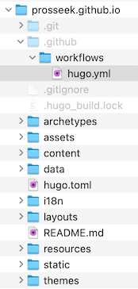
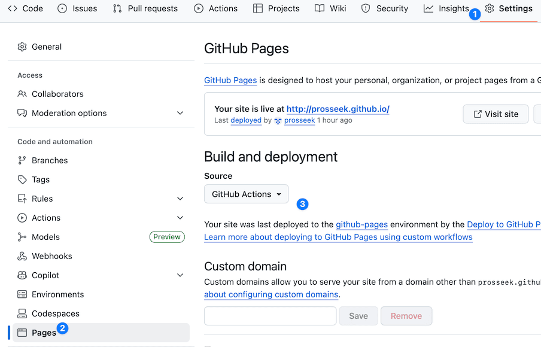
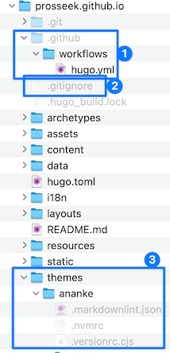

<!-- _class: frontpage -->
<!-- _paginate: skip -->

# Hugo to GitHub.io Automatic Deployment

Sharing Your Hugo Doc/Portfolio with the World Automatically

---

## Step 1: Prepare Your Hugo Site for Automation

1. You need the Hugo project (my-portfolio) as an example (1. Github_io_Manual_Deployment).
2. You need to use `git clone` to clone your GitHub.io repository (2. GitHub_io_Actions_Basics).
3. You need to use VSCode (recommended) or CLI git tools for commit & push your changes.

---

## Step 2: Prepare GitHub Repository for Automation

**Key Difference**: We'll commit Hugo **source files**, not built files (in the `public` directory)!

### **Why Copy Source, Not just the Public directory?**

- GitHub Actions will build the site automatically
- Source control for your content
- Easy updates and collaboration
- Build reproducibility

---

Copy your Hugo project content (for example, the files and directories in the my-portfolio directory) to your cloned GitHub.io (my example, prosseek.github.io).



---

### **Important Configuration for Automation:**

```toml
# In hugo.toml - update baseURL for GitHub Pages
baseURL = 'https://yourusername.github.io'
title = 'Your Professional Portfolio'
theme = 'your-theme-name'
```

---

## Step 5: Create GitHub Actions Workflow

### **Create Workflow File:**

```bash
# Create GitHub Actions directory if necessary
mkdir -p .github/workflows
```

Copy the hugo.yml in `code/6_Github_io/3. Github_io_Hugo_Deployment`.

---

### **Edit `.github/workflows/hugo.yml`:**

Be sure to give permissions to write pages.

```yaml
on:
  push:
    branches: ["main"]
  workflow_dispatch:

permissions:
  contents: read
  pages: write
  id-token: write
```

---

Be sure to use the HUGO version (0.134 or later) to use the theme that we use in this project.

```yaml
jobs:
  build:
    runs-on: ubuntu-latest
    env:
      HUGO_VERSION: 0.134.0
    steps:
      - name: Install Hugo CLI
        run: |
          wget -O ${{ runner.temp }}/hugo.deb https://.../v${HUGO_VERSION}/hugo_extended_${HUGO_VERSION}_linux-amd64.deb \
          && sudo dpkg -i ${{ runner.temp }}/hugo.deb
```

---

Be sure to use the correct checkout and configure-pages prebuilt version.

```yaml
      
      - name: Checkout
        uses: actions/checkout@v4
        with:
          submodules: recursive
          fetch-depth: 0
      - name: Setup Pages
        id: pages
        uses: actions/configure-pages@v4          
```

---

## Step 6: Configure GitHub Pages Settings

For the previous example, hello.yml, we did not need any page settings, because:

- ✅ Runs commands in a virtual machine
- ✅ Shows output in the logs  
- ✅ Completes successfully
- ❌ **Does NOT deploy anything to a website**

---

However, for the hugo.yml, we need page settings because we should deploy pages:

```yaml
- name: Build with Hugo
  run: hugo --minify
- name: Deploy to GitHub Pages  
  uses: actions/deploy-pages@v4    ← This step needs Pages configured!
```

- ✅ Runs commands in a virtual machine
- ✅ Builds your Hugo website
- ✅ **Tries to deploy files to GitHub Pages**
- ❌ **Fails without Pages configuration**

---

### **Enable GitHub Pages:**

1. Go to your repository on GitHub
2. Click **"Settings"** tab
3. Scroll to **"Pages"** in sidebar
4. **Source**: Select "GitHub Actions"
5. Click **"Save"**

---



---

### **Alternative Method (Branch Deploy):**

- **Source**: Deploy from a branch
- **Branch**: gh-pages
- **Folder**: / (root)

**We recommend GitHub Actions for Hugo sites!**

---

## Step 7: Create .gitignore File

Or copy code/6_Github_io/3. Github_io_Hugo_Deployment/gitignore to .gitignore in the github.io directory to skip the next part.

### **Create `.gitignore`:**

```bash
# Create .gitignore file
touch .gitignore
```

---

### **Hugo .gitignore Content:**

```txt
# Hugo build output
public/
resources/_gen/

# Dependencies
node_modules/

# OS files
.DS_Store
Thumbs.db

# Editor files
.vscode/
.idea/
*.swp
*.swo

# Temporary files
*.tmp
*.log
```

**Why ignore public/?** GitHub Actions builds it automatically!

---

## Step 8: Deploy Your Site

Check everything is ready:



---

1. hugo.yml (For GitHub action)
2. .gitignore
3. Make sure there is no `public` directory.
4. Make sure themes are installed.
   1. **Make sure the .git/.github directory is removed to avoid warnings/issues.**

---

Use VSCode or CLI git tools. Run the command in the `github.io` directory.

### **Add, Commit, and Push:**

```bash
# Add all files
git add .

# Commit with descriptive message
git commit -m "Initial Hugo site deployment

- Add complete Hugo source code
- Configure GitHub Actions workflow
- Set up automated deployment"

# Push to GitHub
git push origin main
```

---

### **Monitor Deployment:**

1. Go to your GitHub repository
2. Click **"Actions"** tab
3. Watch your workflow run
4. Green checkmark = successful deployment
5. Red X = build error (check logs)

### **Typical Deploy Time:**

- First deployment: 2-3 minutes
- Subsequent deployments: 1-2 minutes

---

## Step 9: Verify Your Live Site

### **Access Your Site:**

```txt
URL: https://yourusername.github.io
Example: https://johndoe.github.io
```

### **What to Check:**

✅ **Homepage loads** correctly  
✅ **Navigation works** between pages  
✅ **Images display** properly  
✅ **Styling appears** as expected  
✅ **Mobile responsive** design  
✅ **HTTPS works** (should be automatic)  

---

### **Common Issues and Fixes:**

| Issue                  | Cause           | Solution                     |
|------------------------|-----------------|------------------------------|
| **404 Page Not Found** | Wrong repo name | Must be `username.github.io` |
| **Images missing**     | Wrong path      | Use `/images/file.jpg`       |
| **Styling broken**     | Base URL issue  | Check `baseURL` in config    |
| **Build failed**       | Hugo error      | Check Actions logs           |
| **Old content**        | Cache issue     | Hard refresh (Ctrl+F5)       |

---

## Step 10: Update Your Site

### **Making Changes:**

```bash
# Edit your content
hugo new posts/github-pages-deployment.md
# Edit the new file

# Test locally first
hugo server -D

# Build and commit
hugo  # Optional: test build locally
git add .
git commit -m "Add new blog post about deployment"
git push origin main
```

---

### **Automatic Updates:**

- Every Git push triggers a rebuild
- Site updates in 1-2 minutes
- No manual file uploads needed!

---

## Understanding the File Structure

### **Your Basic Repository Structure for Automatic Hugo Deployment:**

```txt
yourusername.github.io/
├── .github/
│   └── workflows/
│       └── hugo.yml          # Deployment automation
├── content/                  # Your Markdown content
│   ├── posts/
│   ├── projects/
│   └── about.md
├── themes/                   # Hugo themes
├── static/                   # Images, CSS, JS
├── hugo.toml                 # Site configuration
├── .gitignore               # Ignore build files
└── README.md                # Repository description
```

**Note**: `public/` folder is generated automatically and not stored in Git

---

### **What Happens During Deployment:**

1. **Git Push** → Triggers GitHub Actions
2. **Actions Runner** → Starts Ubuntu server
3. **Install Hugo** → Downloads Hugo CLI
4. **Checkout Code** → Gets your source files
5. **Build Site** → Runs `hugo --minify`
6. **Generate public/** → Creates static files
7. **Deploy** → Publishes to GitHub Pages
8. **Live Site** → Available at your domain

---

## Advanced Configuration Options

### **Custom Hugo Configuration for GitHub Pages:**

```toml
# hugo.toml
baseURL = 'https://yourusername.github.io'
languageCode = 'en-us'
title = 'Your Name - Software Developer'
theme = 'your-theme'

# GitHub Pages optimizations
[params]
  environment = "production"
  
[markup]
  [markup.goldmark]
    [markup.goldmark.renderer]
      unsafe = true
  [markup.highlight]
    style = 'github'
    lineNos = true

# SEO and performance
enableRobotsTXT = true
enableGitInfo = true
enableEmoji = true
```

---

### **Environment-Specific Settings:**

```toml
# Different settings for local vs production
[params]
  googleAnalytics = "G-XXXXXXXXXX"  # Only in production
  
[deployment]
  [[deployment.targets]]
    name = "github"
    URL = "gh-pages"
    
# Minification for production
[minify]
  disableCSS = false
  disableHTML = false
  disableJS = false
```
